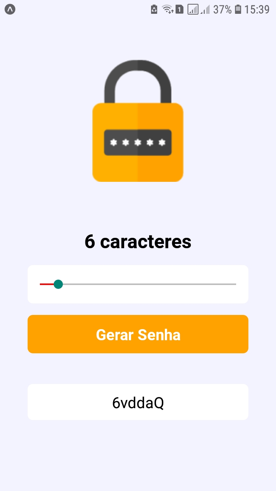

# Gerador de senhas em React Native

## ✅ Descrição do Projeto

 Este projeto foi construído no Insider 2.0, workshop gratuido realizado pelo Matheus do <a href="https://sujeitoprogramador.com/"> Sujeito Programador</a>, com foco no desenvolvimento em <a href="https://reactnative.dev/"> React Native</a>. 

 O Evento ocorreu do dia 10 ao dia 13 de março de 2021. Foram desenvolvidos 2 aplicativos, um Gerador de senhas e um de Previsão do clima. O código aqui presente neste repositório é referente ao Gerador de senhas.

 O objetivo foi mostrar a base do desenvolvimento em React Native, conceitos e funcionálidades que se fazem presentes em toda base e estrutura da progrmação nessa tecnologia.

Alguns conceitos e componentes que foram ultilizados são listados abaixo:

- View
- Text
- Function
- Image
- Estilizções com StyleSheet
- Slider
- Hooks por meio do useState
- Renderização condicional

## 🎁 Imagem de como ficou o aplicativo
<h1 align="center">
  
</h1>

## 🎲 Pré-requisitos e como rodar a aplicação

Estes passos são para rodar o aplicativo pelo [Expo](https://expo.io/)

### Pré-requisitos

Antes de começar, você vai precisar ter instalado em sua máquina as seguintes ferramentas:
[Git](https://git-scm.com), [Node.js](https://nodejs.org/en/) e um editor de código, recomendo o [VSCode](https://code.visualstudio.com/).

Baixe também o aplicativo [Expo Go](https://expo.io/client) em seu celular, pois é por ele que você poderá ver o aplicativo rodando.

### Rodando e executando a aplicação 
#### - Clone este repositório
- git clone <https://github.com/WillianMedeiros14/gerador-de-senhas.git>

#### - Acesse a pasta do projeto no terminal/cmd
- cd gerador-de-senhas

#### -  Instale as dependências, com npm ou yarn
- npm install 
- yarn install

### Rodando o projeto, com npm ou yarn
- npm start
- yarn start

Após isso, irá abrir uma janela no seu navegador, aguarde aparecer um qrcode no canto inferior esquerdo.

### Visualizando o aplicativo rodando em seu celular
- Quando o qrcode aparecer na aba que abriu em seu navegador, abra o aplicativo Expo Go em seu celular e escaneie o qrcode.
- Aguarde a barra de progreesso chegar a 100% e o aplicativo abrirá em seu celular igual amostrado na imagem acima.

## Como ultilizar o aplicativo

- Selecione o tamanho que a senha seja
- Clique em "Gerar senha"
- A senha irá aparecer a baixo do botao "Gerar senha"
- Para copiar a senha, pressione em cima da senha que foi gerada.

### 🛠 Tecnologias

As seguintes ferramentas foram ultilizada na construção do projeto:

- [Expo](https://expo.io/)
- [React Native](https://reactnative.dev/)